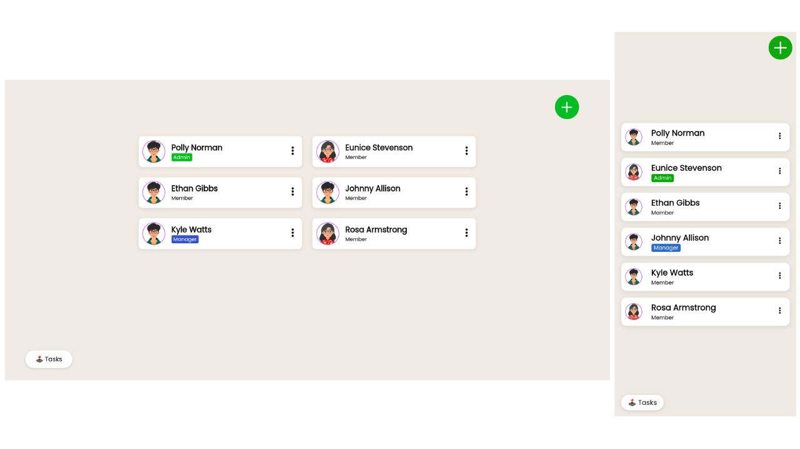

# TeamSpaceApp

This project was generated using [Angular CLI](https://github.com/angular/angular-cli) version 19.0.1.

## Development

Commands for local development server:

```bash
npm install   # install dependencies
ng serve      # to start dev server
ng test       # to test
ng build      # to build
```

Once the server is running, open your browser and navigate to `http://localhost:4200/`. The application will automatically reload whenever you modify any of the source files.

## Screenshots


